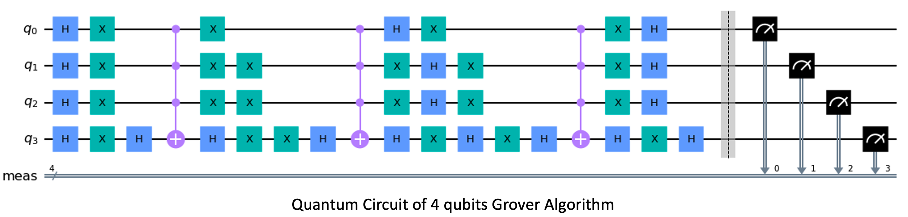

# Bisection Grover’s Search Algorithm  and Its Application in Analyzing CITE-seq Data

## Set environments and install packages

#### python

conda create -n BGS python=3.7 anaconda

conda activate BGS

pip install -r `requirements.txt` 

#### R

required packages are 

Seurat v5

ggplot2 3.4.2

cowplot 1.1.1

dplyr 1.1.2

leaps 3.1

paletteer 1.5.0

scales 1.2.1

foreach 1.5.2

doParallel 1.0.17

## Run experiments

### experiment on IBM Quantum system

Upload `BGS_IBM_experiment.ipynb` and `utility.py` to https://lab.quantum-computing.ibm.com/. You need to change the provider information in the code `utility.py`.

For example, setting `provider = IBMQ.get_provider(hub = "ibm-q", group='open', project='main')`

You can change the Quantum system service. For example, setting `provider.get_backend('ibmq_manila')`.

Some services do not provide public access. A recommended approach to test the code is to use the 'ibmq_qasm_simulator' service. Be noticed that 'ibmq_qasm_simulator' isn't real quantum computer thought.

A list of different Quantum systems is available in https://quantum-computing.ibm.com/services?services=systems.

The `BGS_IBM_experiment.ipynb` is the code for running time analysis

## Acknowledgement

Detailed tutorials of constructing Quantum circuit and implementation of Quantum algorithms can be found in https://qiskit.org/documentation/tutorials.html

## Contact us

Website: https://bigdata.uga.edu/
